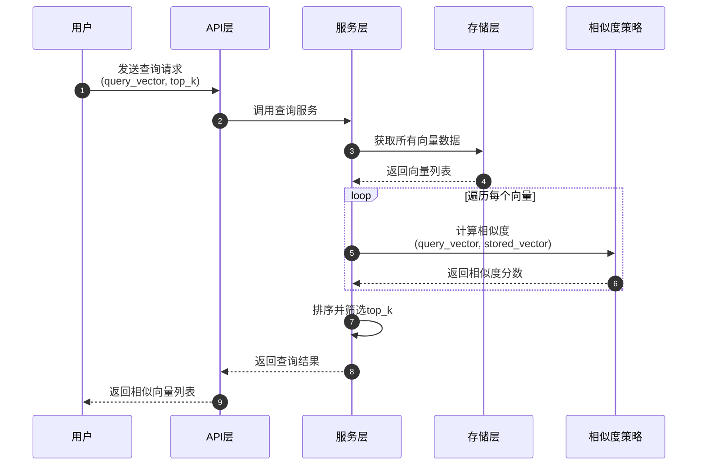
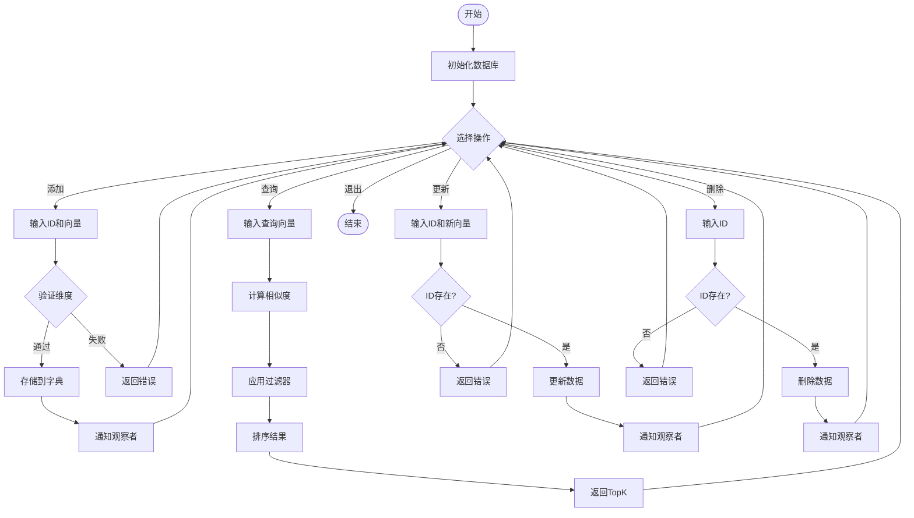
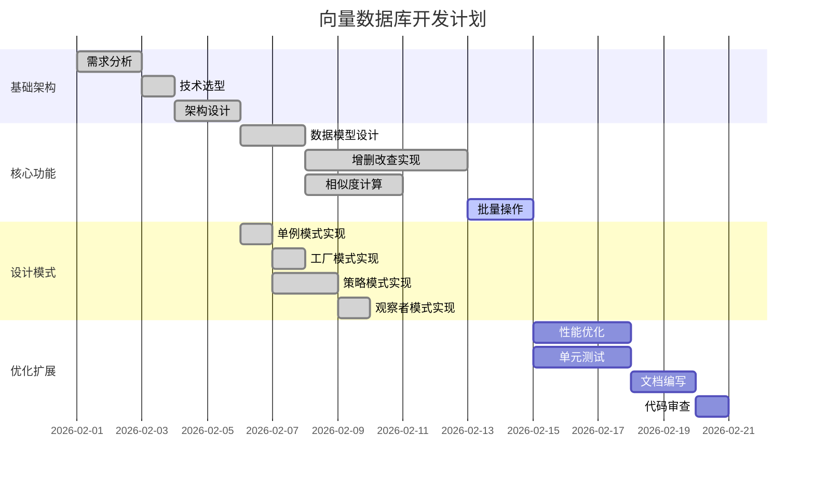

# 向量数据库软件架构 - Mermaid图表

## 1. 时序图：向量查询流程

## 2. 流程图：向量数据库核心功能

## 3. 甘特图：向量数据库开发计划

## 图表说明

### 时序图说明
- 展示了用户查询向量的完整流程
- 包含4个参与者：用户、API层、服务层、存储层、相似度策略
- 展示了数据流向和交互顺序

### 流程图说明
- 展示了向量数据库的4个核心功能：增、删、改、查
- 包含验证、错误处理、观察者通知等流程
- 使用不同颜色区分不同操作路径

### 甘特图说明
- 展示了向量数据库的开发计划
- 分为4个阶段：基础架构、核心功能、设计模式、优化扩展
- 标注了已完成和进行中的任务
